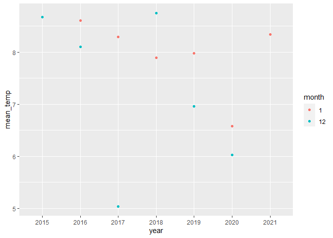
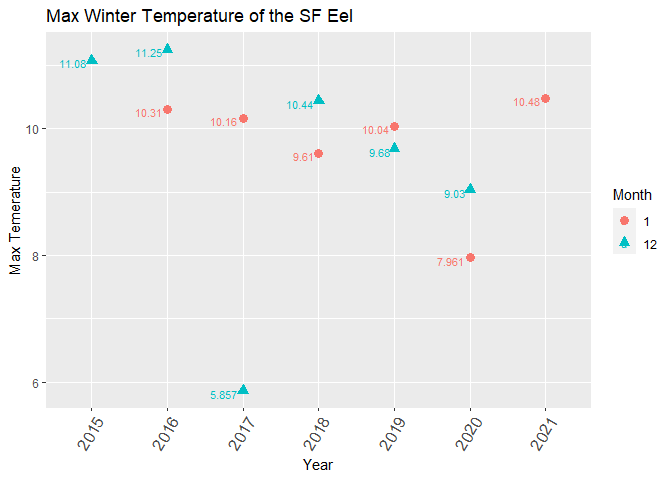

```r
library(tidyverse)
```

```
## Warning: package 'tidyverse' was built under R version 4.1.1
```

```
## -- Attaching packages --------------------------------------- tidyverse 1.3.1 --
```

```
## v ggplot2 3.3.5     v purrr   0.3.4
## v tibble  3.1.4     v dplyr   1.0.7
## v tidyr   1.1.3     v stringr 1.4.0
## v readr   2.0.1     v forcats 0.5.1
```

```
## Warning: package 'tibble' was built under R version 4.1.1
```

```
## Warning: package 'tidyr' was built under R version 4.1.1
```

```
## Warning: package 'readr' was built under R version 4.1.1
```

```
## Warning: package 'purrr' was built under R version 4.1.1
```

```
## Warning: package 'stringr' was built under R version 4.1.1
```

```
## Warning: package 'forcats' was built under R version 4.1.1
```

```
## -- Conflicts ------------------------------------------ tidyverse_conflicts() --
## x dplyr::filter() masks stats::filter()
## x dplyr::lag()    masks stats::lag()
```


```r
W2015<-read.csv("2015-winter.csv")
W2016<-read.csv("2016-winter.csv")
W2017<-read.csv("2017-winter.csv")
W2018<-read.csv("2018-winter.csv")
W2019<-read.csv("2019-winter.csv")
W2020<-read.csv("2020-winter.csv")
```


```r
head(W2015)
```

```
##           ï..Time Angelo.HQ.SF.Eel.Gage.Water.Temp.Outside.CS450.degC
## 1 12/15/2015 0:00                                                8.80
## 2 12/15/2015 0:05                                                8.79
## 3 12/15/2015 0:10                                                8.79
## 4 12/15/2015 0:15                                                8.78
## 5 12/15/2015 0:20                                                8.77
## 6 12/15/2015 0:25                                                8.76
```


```r
w2015_new<-W2015%>%
  separate(col="ï..Time",into=c("date","time"),sep=" ")
w2016_new<-W2016%>%
  separate(col="ï..Time",into=c("date","time"),sep=" ")
w2017_new<-W2017%>%
  separate(col="ï..Time",into=c("date","time"),sep=" ")
w2018_new<-W2018%>%
  separate(col="ï..Time",into=c("date","time"),sep=" ")
w2019_new<-W2019%>%
  separate(col="ï..Time",into=c("date","time"),sep=" ")
w2020_new<-W2020%>%
  separate(col="ï..Time",into=c("date","time"),sep=" ")
```


```r
w2015_3<-w2015_new%>%
  separate(col="date",into=c("month","day","year"),sep="/")
```

```r
w2016_3<-w2016_new%>%
  separate(col="date",into=c("month","day","year"),sep="/")
w2017_3<-w2017_new%>%
  separate(col="date",into=c("month","day","year"),sep="/")
w2018_3<-w2018_new%>%
  separate(col="date",into=c("month","day","year"),sep="/")
w2019_3<-w2019_new%>%
  separate(col="date",into=c("month","day","year"),sep="/")
w2020_3<-w2020_new%>%
  separate(col="date",into=c("month","day","year"),sep="/")
```


```r
test<-full_join(w2015_3,w2016_3)
```

```
## Joining, by = c("month", "day", "year", "time", "Angelo.HQ.SF.Eel.Gage.Water.Temp.Outside.CS450.degC")
```

```r
test2<-full_join(test,w2017_3)
```

```
## Joining, by = c("month", "day", "year", "time", "Angelo.HQ.SF.Eel.Gage.Water.Temp.Outside.CS450.degC")
```

```r
test3<-full_join(test2,w2018_3)
```

```
## Joining, by = c("month", "day", "year", "time", "Angelo.HQ.SF.Eel.Gage.Water.Temp.Outside.CS450.degC")
```

```r
test4<-full_join(test3,w2019_3)
```

```
## Joining, by = c("month", "day", "year", "time", "Angelo.HQ.SF.Eel.Gage.Water.Temp.Outside.CS450.degC")
```

```r
test5<-full_join(test4,w2020_3)
```

```
## Joining, by = c("month", "day", "year", "time", "Angelo.HQ.SF.Eel.Gage.Water.Temp.Outside.CS450.degC")
```

```r
table_temp<-test5%>%
  group_by(month,year)%>%
  summarise(mean_temp=mean(Angelo.HQ.SF.Eel.Gage.Water.Temp.Outside.CS450.degC),max_temp=max(Angelo.HQ.SF.Eel.Gage.Water.Temp.Outside.CS450.degC),min_temp=min(Angelo.HQ.SF.Eel.Gage.Water.Temp.Outside.CS450.degC))
```

```
## `summarise()` has grouped output by 'month'. You can override using the `.groups` argument.
```

```r
table_temp
```

```
## # A tibble: 12 x 5
## # Groups:   month [2]
##    month year  mean_temp max_temp min_temp
##    <chr> <chr>     <dbl>    <dbl>    <dbl>
##  1 1     2016       8.60    10.3      5.68
##  2 1     2017       8.29    10.2      5.60
##  3 1     2018       7.89     9.61     5.17
##  4 1     2019       7.98    10.0      5.11
##  5 1     2020       6.58     7.96     4.31
##  6 1     2021       8.34    10.5      5.66
##  7 12    2015       8.68    11.1      6.76
##  8 12    2016       8.10    11.2      6.64
##  9 12    2017       5.04     5.86     3.52
## 10 12    2018       8.75    10.4      6.45
## 11 12    2019       6.96     9.68     4.24
## 12 12    2020       6.03     9.03     3.78
```

```r
table_temp%>%
  ggplot(aes(x=year,y=mean_temp,color=month))+
  geom_point()
```

<!-- -->

```r
table_temp%>%
  ggplot(aes(x=year,y=min_temp,color=month))+
  geom_point()
```

<!-- -->


```r
table_temp%>%
  ggplot(aes(x=year,y=max_temp,color=month,shape=month))+
  geom_point(size=3)+
  geom_text(aes(label=max_temp),vjust=.8,hjust=1.2,size=3)+
  labs(title="Max Winter Temperature of the SF Eel",x="Year",y="Max Temerature")+
  theme(axis.text.x = element_text(angle = 60,hjust = 1,size=12))+
  labs(color="Month",shape="Month")
```

<!-- -->

```r
table_temp%>%
  ggplot(aes(x=year,y=mean_temp,color=month,shape=month))+
  geom_point(size=3)+
  geom_text(aes(label=mean_temp),vjust=.8,hjust=1.2,size=3)+
  labs(title="Mean Winter Temperature of the SF Eel",x="Year",y="Mean Temerature")+
  theme(axis.text.x = element_text(angle = 60,hjust = 1,size=12))+
  labs(color="Month",shape="Month")
```

<!-- -->

```r
table_temp%>%
  ggplot(aes(x=year,y=min_temp,color=month,shape=month))+
  geom_point(size=3)+
  geom_text(aes(label=min_temp),vjust=.8,hjust=1.2,size=3)+
  labs(title="Min Winter Temperature of the SF Eel",x="Year",y="Min Temerature")+
  theme(axis.text.x = element_text(angle = 60,hjust = 1,size=12))+
  labs(color="Month",shape="Month")
```

<!-- -->

```r
table_temp%>%
  mutate(temp_range=(max_temp-min_temp))%>%
  ggplot(aes(x=year,y=temp_range,color=month,shape=month))+
  geom_point(size=3)+geom_text(aes(label=temp_range),vjust=.8,hjust=1.2,size=3)+
  labs(title="Winter Temperature Range of the SF Eel",x="Year",y="Temerature Range")+
  theme(axis.text.x = element_text(angle = 60,hjust = 1,size=12))+
  labs(color="Month",shape="Month")
```

<!-- -->

```r
test5%>%
  group_by(month)%>%
  summarise(mean_temp=mean(Angelo.HQ.SF.Eel.Gage.Water.Temp.Outside.CS450.degC))%>%
  arrange(desc(mean_temp))
```

```
## # A tibble: 2 x 2
##   month mean_temp
##   <chr>     <dbl>
## 1 1          7.93
## 2 12         7.26
```

```r
test5%>%
  group_by(month)%>%
  summarise(max_temp=max(Angelo.HQ.SF.Eel.Gage.Water.Temp.Outside.CS450.degC))%>%
  arrange(desc(max_temp))
```

```
## # A tibble: 2 x 2
##   month max_temp
##   <chr>    <dbl>
## 1 12        11.2
## 2 1         10.5
```


