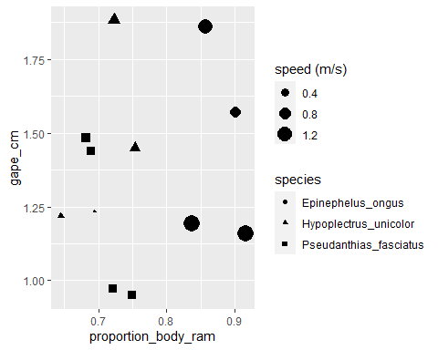
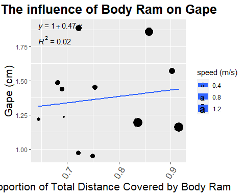
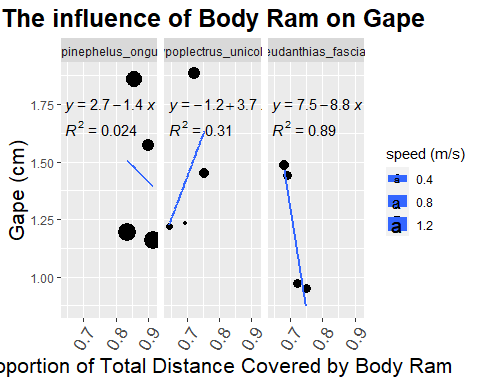
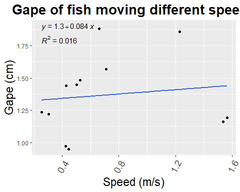

```r
library(tidyverse)
```

```
## -- Attaching packages --------------------------------------- tidyverse 1.3.1 --
```

```
## v ggplot2 3.3.3     v purrr   0.3.4
## v tibble  3.1.1     v dplyr   1.0.6
## v tidyr   1.1.3     v stringr 1.4.0
## v readr   1.4.0     v forcats 0.5.1
```

```
## -- Conflicts ------------------------------------------ tidyverse_conflicts() --
## x dplyr::filter() masks stats::filter()
## x dplyr::lag()    masks stats::lag()
```

```r
library(StereoMorph)
library(ggplot2)
library(here)
```

```
## here() starts at C:/Users/ericc/Desktop/General-Repository
```

```r
library(ggthemes)
library(paletteer)
library(ggpubr)
```


```r
morphology_data <- readr::read_csv("morphology_data.csv")
```

```
## 
## -- Column specification --------------------------------------------------------
## cols(
##   video = col_character(),
##   body_ram = col_double(),
##   jaw_ram = col_double(),
##   time_ms = col_double(),
##   total_distance_cm = col_double(),
##   proportion_body_ram = col_double(),
##   proportion_jaw_ram = col_double(),
##   gape_cm = col_double(),
##   suction = col_double(),
##   `speed (m/s)` = col_double(),
##   species = col_character()
## )
```

```r
head(morphology_data)
```

```
## # A tibble: 6 x 11
##   video         body_ram jaw_ram time_ms total_distance_cm proportion_body_ram
##   <chr>            <dbl>   <dbl>   <dbl>             <dbl>               <dbl>
## 1 ongus1_08         2.74   0.791      26              3.20               0.858
## 2 fasciatus3_11     1.33   0.792      45              1.92               0.689
## 3 ongus1_13         4.10   0.765      64              4.55               0.902
## 4 fasciatus4_17     1.74   0.871      57              2.41               0.721
## 5 fasciatus4_05     1.76   0.799      53              2.35               0.749
## 6 ongus4_20         5.07   0.799      36              5.53               0.916
## # ... with 5 more variables: proportion_jaw_ram <dbl>, gape_cm <dbl>,
## #   suction <dbl>, speed (m/s) <dbl>, species <chr>
```


```r
morphology_data%>%
  ggplot(aes(x=proportion_body_ram,y=gape_cm,shape=species,size=`speed (m/s)`))+
  geom_point()
```

<!-- -->

```r
morphology_data%>%
  ggplot(aes(x=proportion_body_ram,y=gape_cm,size=`speed (m/s)`))+
  geom_point()+
  geom_smooth(method = lm,se=F)+
  stat_regline_equation(label.y=1.9,aes(label = ..eq.label..)) +
  stat_regline_equation(label.y=1.8,aes(label = ..rr.label..))+
  theme(legend.position = "right",
        axis.text.x = element_text(angle = 60, hjust=1,size = 13),axis.title = element_text(size = 16),plot.title = element_text(size = 19,face = "bold",hjust = .5))+
  labs(title = "The influence of Body Ram on Gape",x="Proportion of Total Distance Covered by Body Ram",y="Gape (cm)")
```

```
## `geom_smooth()` using formula 'y ~ x'
```

<!-- -->

```r
morphology_data%>%
  ggplot(aes(x=proportion_body_ram,y=gape_cm,size=`speed (m/s)`))+
  geom_point()+
  geom_smooth(method = lm,se=F)+
  stat_regline_equation(label.y=1.75,aes(label = ..eq.label..)) +
  stat_regline_equation(label.y=1.65,aes(label = ..rr.label..))+
  theme(legend.position = "right",
        axis.text.x = element_text(angle = 60, hjust=1,size = 13),axis.title = element_text(size = 16),plot.title = element_text(size = 19,face = "bold",hjust = .5))+
  labs(title = "The influence of Body Ram on Gape",x="Proportion of Total Distance Covered by Body Ram",y="Gape (cm)")+
  facet_wrap(~species)
```

```
## `geom_smooth()` using formula 'y ~ x'
```

<!-- -->


```r
morphology_data%>%
  ggplot(aes(x=`speed (m/s)`,y=gape_cm))+
  geom_point()+
  geom_smooth(method = lm,se=F)+
  stat_regline_equation(label.y=1.9,aes(label = ..eq.label..)) +
  stat_regline_equation(label.y=1.8,aes(label = ..rr.label..))+
  theme(legend.position = "right",
        axis.text.x = element_text(angle = 60, hjust=1,size = 14),axis.title = element_text(size = 17),plot.title = element_text(size = 20,face = "bold",hjust = .5))+
  labs(title = "Gape of fish moving different speeds",x="Speed (m/s)",y="Gape (cm)")
```

```
## `geom_smooth()` using formula 'y ~ x'
```

<!-- -->

