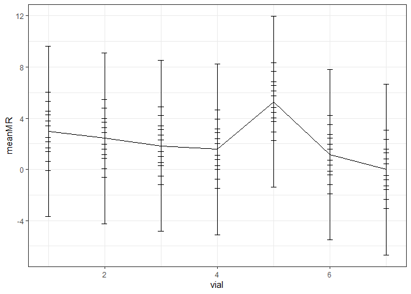
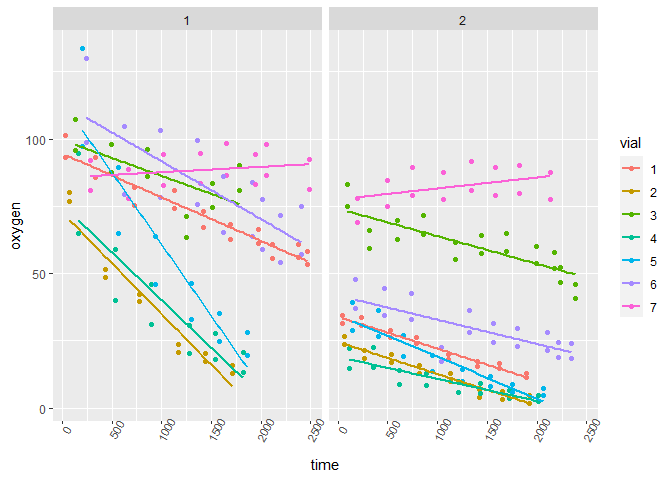

```r
data<-read.csv("Trial2_11_20_MCMP.csv")
```


```r
cal<-read.csv("Cal_MCMP_Revised.csv")
```


```r
O2sat<-read.csv("MCMP_O2_Sat.csv")
```


```r
optode<-function(cal0,T0,cal100,T100,phase,temp) {
f1=0.801
deltaPsiK=-0.08
deltaKsvK=0.000383
m=22.9
tan0T100=tan(((cal0+deltaPsiK*(T100-T0)))*pi/180)
tan0Tm=tan((cal0+(deltaPsiK*(temp-T0)))*pi/180)
tan100T100=tan(cal100*pi/180)
tanmTm=tan(phase*pi/180)
A=tan100T100/tan0T100*1/m*100^2
B=tan100T100/tan0T100*100+tan100T100/tan0T100*1/m*100-f1*1/m*100-100+f1*100
C=tan100T100/tan0T100-1
KsvT100=(-B+(sqrt(B^2-4*A*C)))/(2*A)
KsvTm=KsvT100+(deltaKsvK*(temp-T100))
a=tanmTm/tan0Tm*1/m*KsvTm^2
b=tanmTm/tan0Tm*KsvTm+tanmTm/tan0Tm*1/m*KsvTm-f1*1/m*KsvTm-KsvTm+f1*KsvTm
c=tanmTm/tan0Tm-1
saturation=(-((tan(phase*pi/180))/(tan((cal0+(deltaPsiK*(temp-T0)))*pi/180))*
(KsvT100+(deltaKsvK*(temp-T100)))+(tan(phase*pi/180))/(tan((cal0+(deltaPsiK*
(temp-T0)))*pi/180))*1/m*(KsvT100+(deltaKsvK*(temp-T100)))-f1*1/m*(KsvT100+
(deltaKsvK*(temp-T100)))-(KsvT100+(deltaKsvK*(temp-T100)))+f1*(KsvT100+
(deltaKsvK*(temp-T100))))+(sqrt((((tan(phase*pi/180))/(tan((cal0+(deltaPsiK*
(temp-T0)))*pi/180))*(KsvT100+(deltaKsvK*(temp-T100)))+(tan(phase*pi/180))/
(tan((cal0+(deltaPsiK*(temp-T0)))*pi/180))*1/m*(KsvT100+(deltaKsvK*(temp-T100)))
-f1*1/m*(KsvT100+(deltaKsvK*(temp-T100)))-
(KsvT100+(deltaKsvK*(temp-T100)))+f1*
(KsvT100+(deltaKsvK*(temp-T100)))))^2-4*
((tan(phase*pi/180))/(tan((cal0+(deltaPsiK*
(temp-T0)))*pi/180))*1/m*(KsvT100+
(deltaKsvK*(temp-T100)))^2)*((tan(phase*pi/180))/
(tan((cal0+(deltaPsiK*
(temp-T0)))*pi/180))-1))))/(2*((tan(phase*pi/180))/
(tan((cal0+(deltaPsiK*(temp-T0)))*pi/180))*
1/m*(KsvT100+(deltaKsvK*(temp-T100)))^2))
}
```


```r
dataCombin<-merge(data,cal,by="vial")
```


```r
dataCombin<-merge(dataCombin,O2sat)
```


```r
f<-function(d) optode(d$cal0,d$T0,d$cal100,d$T100,d$phase,d$temp)
```


```r
dataCombin$oxygen<-f(dataCombin)
```


```r
dataCombin$umoleO2<-(dataCombin$oxygen/100)*dataCombin$O2sat
```


```r
dataCombin$time<-as.numeric(dataCombin$time)
```


```r
dataCombin$treatment<-as.numeric(dataCombin$treatment)
```


```r
library(plyr)
```

```
## Warning: package 'plyr' was built under R version 4.1.1
```

```r
mlist<-dlply(dataCombin,.(vial, treatment), function(d) lm(umoleO2~time, data=d))
output<-ldply(mlist, function(m) coef(m))
output$slope<-abs(output$time)
```


```r
meanControl<-mean(output[output$vial=="7","slope"])
```


```r
meanControl
```

```
## [1] 0.0002415563
```


```r
output$adj.slope<-output$slope-meanControl
```


```r
head(output)
```

```
##   vial treatment (Intercept)          time        slope    adj.slope
## 1    1         1    7.775471 -0.0013186062 0.0013186062 0.0010770498
## 2    1         2    2.468413 -0.0008617217 0.0008617217 0.0006201654
## 3    2         1    5.963799 -0.0030870799 0.0030870799 0.0028455236
## 4    2         2    1.782922 -0.0008606753 0.0008606753 0.0006191190
## 5    3         1    8.152126 -0.0010492211 0.0010492211 0.0008076647
## 6    3         2    5.395133 -0.0007469819 0.0007469819 0.0005054256
```


```r
mass<-read.csv("MCMP_mass.csv")
```


```r
final<-merge(output,mass)
```


```r
final$umoleO2minmg<-(final$adj.slope*(70/1000))/(final$mass)
final$umoleO2hrg<-final$umoleO2minmg*1000*60
```


```r
head(final)
```

```
##   vial treatment (Intercept)          time        slope    adj.slope mass
## 1    1         1    7.775471 -0.0013186062 0.0013186062 0.0010770498  1.2
## 2    1         2    2.468413 -0.0008617217 0.0008617217 0.0006201654  1.2
## 3    2         1    5.963799 -0.0030870799 0.0030870799 0.0028455236  3.0
## 4    2         2    1.782922 -0.0008606753 0.0008606753 0.0006191190  3.0
## 5    3         1    8.152126 -0.0010492211 0.0010492211 0.0008076647  1.5
## 6    3         2    5.395133 -0.0007469819 0.0007469819 0.0005054256  1.5
##   umoleO2minmg umoleO2hrg
## 1 6.282791e-05  3.7696744
## 2 3.617631e-05  2.1705789
## 3 6.639555e-05  3.9837330
## 4 1.444611e-05  0.8667666
## 5 3.769102e-05  2.2614613
## 6 2.358653e-05  1.4151916
```


```r
library(plotrix)
```

```
## Warning: package 'plotrix' was built under R version 4.1.1
```

```r
meanMR<-ddply(final, .(treatment), function(d) mean(d$umoleO2hrg, na.rm=T))
names(meanMR)<-c("treatment","meanMR")
sdMR<-ddply(final, .(treatment), function(d) sd(d$umoleO2hrg, na.rm=T))
names(sdMR)<-c("treatment","sdMR")
seMR<-ddply(final, .(treatment), function(d) std.error(d$umoleO2hrg, na.rm=T))
names(seMR)<-c("treatment","seMR")
meanData<-merge(meanMR, sdMR)
meanData<-merge(meanData, seMR)
meanData<-merge(meanData, seMR)
CI95<-meanData$seMR*1.96
meanData$CI95<-CI95
```


```r
library(plotrix)
meanMR<-ddply(final, .(vial), function(d) mean(d$umoleO2hrg, na.rm=T))
names(meanMR)<-c("vial","meanMR")
sdMR<-ddply(final, .(vial), function(d) sd(d$umoleO2hrg, na.rm=T))
names(sdMR)<-c("vial","sdMR")
seMR<-ddply(final, .(vial), function(d) std.error(d$umoleO2hrg, na.rm=T))
names(seMR)<-c("treatment","seMR")
meanData<-merge(meanMR, sdMR)
meanData<-merge(meanData, seMR)
meanData<-merge(meanData, seMR)
CI95<-meanData$seMR*1.96
meanData$CI95<-CI95
```


```r
library(ggplot2)
library(grid)
p=ggplot(meanData,aes(vial, meanMR))
p+geom_line()+
geom_errorbar(aes(ymax=meanMR+CI95, ymin=meanMR-CI95), width=0.1)+
theme(axis.text.x=element_text(size=12),
axis.text.y=element_text(size=12),
axis.title.y=element_text(vjust=-0.1,angle=90, size=14),
axis.title.x=element_text(size=14),
plot.margin=unit(c(1, 1, 1, 2), "lines"))+
theme_bw()
```

<!-- -->

```r
library(tidyverse)
```

```
## Warning: package 'tidyverse' was built under R version 4.1.1
```

```
## -- Attaching packages --------------------------------------- tidyverse 1.3.1 --
```

```
## v tibble  3.1.5     v dplyr   1.0.7
## v tidyr   1.1.4     v stringr 1.4.0
## v readr   2.0.2     v forcats 0.5.1
## v purrr   0.3.4
```

```
## Warning: package 'tibble' was built under R version 4.1.1
```

```
## Warning: package 'tidyr' was built under R version 4.1.1
```

```
## Warning: package 'readr' was built under R version 4.1.1
```

```
## Warning: package 'purrr' was built under R version 4.1.1
```

```
## Warning: package 'stringr' was built under R version 4.1.1
```

```
## Warning: package 'forcats' was built under R version 4.1.1
```

```
## -- Conflicts ------------------------------------------ tidyverse_conflicts() --
## x dplyr::arrange()   masks plyr::arrange()
## x purrr::compact()   masks plyr::compact()
## x dplyr::count()     masks plyr::count()
## x dplyr::failwith()  masks plyr::failwith()
## x dplyr::filter()    masks stats::filter()
## x dplyr::id()        masks plyr::id()
## x dplyr::lag()       masks stats::lag()
## x dplyr::mutate()    masks plyr::mutate()
## x dplyr::rename()    masks plyr::rename()
## x dplyr::summarise() masks plyr::summarise()
## x dplyr::summarize() masks plyr::summarize()
```

```r
library(ggplot2)
```


```r
final$vial<-as.character(final$vial)
final%>%
  ggplot(aes(x=vial,y=umoleO2hrg,fill=vial))+
  geom_col()+
  facet_wrap(~treatment)
```

<!-- -->

```r
view(dataCombin)
```


```r
dataCombin$vial<-as.character(dataCombin$vial)
dataCombin%>%
  ggplot(aes(x=time,y=oxygen,color=vial))+
  geom_point()+
  geom_smooth(method=lm, se=FALSE)+
  facet_wrap(~treatment)+
  theme(axis.text.x = element_text(angle = 60,size=8))
```

```
## `geom_smooth()` using formula 'y ~ x'
```

<!-- -->

```r
dataCombin%>%
  group_by(vial)%>%
  filter(time<1000)%>%
  filter(treatment==1)
```

```
## # A tibble: 40 x 19
## # Groups:   vial [7]
##    trial treatment vial   temp  time phase round salinity.... pressure..inHg.
##    <chr>     <dbl> <chr> <dbl> <dbl> <dbl> <int>        <dbl>           <dbl>
##  1 2a            1 1      14.2    35  31.4     1         37.5            30.2
##  2 2a            1 1      14.2    35  31.4     1         37.5            30.2
##  3 2a            1 7      14.2   281  30.1     1         37.5            30.2
##  4 2a            1 7      14.2   281  30.1     1         37.5            30.2
##  5 2a            1 6      14.2   248  30.1     1         37.5            30.2
##  6 2a            1 2      14.2   433  37.5     2         37.5            30.2
##  7 2a            1 2      14.2   433  37.5     2         37.5            30.2
##  8 2a            1 1      14.2   337  32.3     2         37.5            30.2
##  9 2a            1 5      14.2   205  30.6     1         37.5            30.2
## 10 2a            1 5      14.2   205  30.6     1         37.5            30.2
## # ... with 30 more rows, and 10 more variables: amplitude <chr>, day <int>,
## #   cal0 <dbl>, cal100 <dbl>, T0 <dbl>, T100 <dbl>, Salinity.... <dbl>,
## #   O2sat <dbl>, oxygen <dbl>, umoleO2 <dbl>
```

```r
view(data)
```

