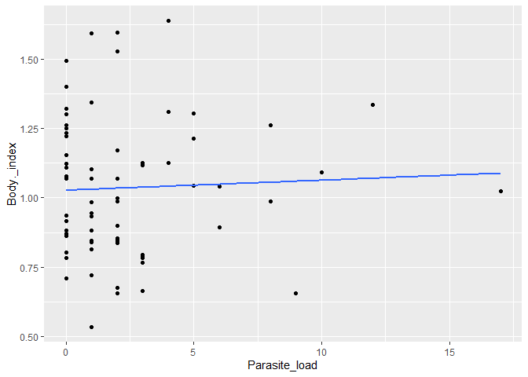
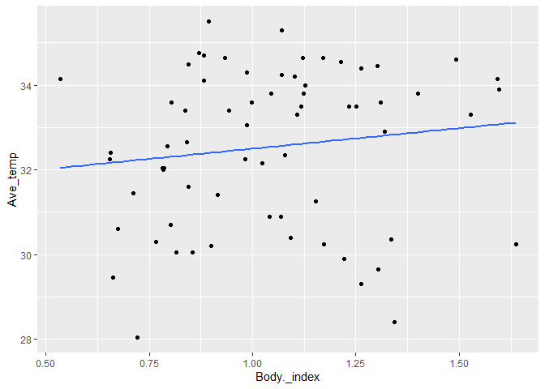

```r
library(tidyverse)
```

```
## Warning: package 'tidyverse' was built under R version 4.1.1
```

```
## -- Attaching packages --------------------------------------- tidyverse 1.3.1 --
```

```
## v ggplot2 3.3.5     v purrr   0.3.4
## v tibble  3.1.5     v dplyr   1.0.7
## v tidyr   1.1.4     v stringr 1.4.0
## v readr   2.0.2     v forcats 0.5.1
```

```
## Warning: package 'tibble' was built under R version 4.1.1
```

```
## Warning: package 'tidyr' was built under R version 4.1.1
```

```
## Warning: package 'readr' was built under R version 4.1.1
```

```
## Warning: package 'purrr' was built under R version 4.1.1
```

```
## Warning: package 'stringr' was built under R version 4.1.1
```

```
## Warning: package 'forcats' was built under R version 4.1.1
```

```
## -- Conflicts ------------------------------------------ tidyverse_conflicts() --
## x dplyr::filter() masks stats::filter()
## x dplyr::lag()    masks stats::lag()
```

```r
library(naniar)
```

```
## Warning: package 'naniar' was built under R version 4.1.1
```


```r
Thermal24<-read.csv("MCMP_quantify.csv")
```


```r
Thermal24_new<-Thermal24%>%
  mutate(Micoplastic_load = as.numeric(Microplastic_load))%>%
  mutate(Adjusted_microplastic_load = as.numeric(Adjusted_microplastic_load))%>%mutate(Ave_temp = as.numeric(Ave_temp))%>%mutate(Micoplastic_load = as.numeric(Microplastic_load))%>%
  mutate(Parasite_load=as.integer(Parasite_load))
```


```r
Thermal24_new%>%
  ggplot(aes(x=ID, y=Adjusted_microplastic_load,fill=ID))+
  geom_col()
```

```
## Warning: Removed 3 rows containing missing values (position_stack).
```

<!-- -->


```r
Thermal24_3<-Thermal24_new%>%
  filter(Adjusted_microplastic_load>0)
```


```r
Thermal24_3%>%
  ggplot(aes(x=ID, y=Adjusted_microplastic_load,fill=ID))+
  geom_col()+
  theme(axis.text.x = element_text(angle = 90, size = 7, vjust = 1))
```

<!-- -->


```r
Thermal24_3%>%
  ggplot(aes(x=Adjusted_microplastic_load, y=Ave_temp))+
  geom_point()+
  geom_smooth(se=F,method=lm)
```

```
## `geom_smooth()` using formula 'y ~ x'
```

```
## Warning: Removed 2 rows containing non-finite values (stat_smooth).
```

```
## Warning: Removed 2 rows containing missing values (geom_point).
```

<!-- -->

```r
Thermal24_3%>%
  ggplot(aes(x=Adjusted_microplastic_load, y=Body._index))+
  geom_point()+
  geom_smooth(se=F,method=lm)
```

```
## `geom_smooth()` using formula 'y ~ x'
```

<!-- -->


```r
Thermal24_3%>%
  ggplot(aes(x=Adjusted_microplastic_load, y=Weight))+
  geom_point()+
  geom_smooth(se=F,method=lm)
```

```
## `geom_smooth()` using formula 'y ~ x'
```

<!-- -->

```r
Thermal24_3%>%
  ggplot(aes(x=Adjusted_microplastic_load, y=Length))+
  geom_point()+
  geom_smooth(se=F,method=lm)
```

```
## `geom_smooth()` using formula 'y ~ x'
```

<!-- -->

```r
Thermal24_3%>%
  ggplot(aes(x=Adjusted_microplastic_load, y=Width))+
  geom_point()+
  geom_smooth(se=F,method=lm)
```

```
## `geom_smooth()` using formula 'y ~ x'
```

<!-- -->

```r
library(broom)
```

```
## Warning: package 'broom' was built under R version 4.1.1
```

```r
library(moderndive)
```

```
## Warning: package 'moderndive' was built under R version 4.1.2
```


```r
MP_model<-lm(Ave_temp~Adjusted_microplastic_load, data = Thermal24_3)
```


```r
get_regression_table(MP_model)
```

```
## # A tibble: 2 x 7
##   term                    estimate std_error statistic p_value lower_ci upper_ci
##   <chr>                      <dbl>     <dbl>     <dbl>   <dbl>    <dbl>    <dbl>
## 1 intercept                   32.6     0.299   109.        0       32.0     33.2
## 2 Adjusted_microplastic_~      0       0        -0.527     0.6      0        0
```


```r
get_regression_summaries(MP_model)
```

```
## # A tibble: 1 x 9
##   r_squared adj_r_squared   mse  rmse sigma statistic p_value    df  nobs
##       <dbl>         <dbl> <dbl> <dbl> <dbl>     <dbl>   <dbl> <dbl> <dbl>
## 1     0.004        -0.011  3.37  1.84  1.86     0.278     0.6     1    67
```

```r
Length_model<-lm(Length~Adjusted_microplastic_load, data = Thermal24_3)
get_regression_table(Length_model)
```

```
## # A tibble: 2 x 7
##   term                    estimate std_error statistic p_value lower_ci upper_ci
##   <chr>                      <dbl>     <dbl>     <dbl>   <dbl>    <dbl>    <dbl>
## 1 intercept                   18.9     0.885     21.4     0        17.1     20.7
## 2 Adjusted_microplastic_~      0       0          1.62    0.11      0        0
```

```r
get_regression_summaries(Length_model)
```

```
## # A tibble: 1 x 9
##   r_squared adj_r_squared   mse  rmse sigma statistic p_value    df  nobs
##       <dbl>         <dbl> <dbl> <dbl> <dbl>     <dbl>   <dbl> <dbl> <dbl>
## 1     0.038         0.023  30.5  5.52  5.60      2.63    0.11     1    69
```

```r
Weight_model<-lm(Weight~Adjusted_microplastic_load, data = Thermal24_3)
get_regression_table(Weight_model)
```

```
## # A tibble: 2 x 7
##   term                    estimate std_error statistic p_value lower_ci upper_ci
##   <chr>                      <dbl>     <dbl>     <dbl>   <dbl>    <dbl>    <dbl>
## 1 intercept                   1.39     0.173      8.03   0         1.05     1.74
## 2 Adjusted_microplastic_~     0        0          1.31   0.196     0        0
```

```r
get_regression_summaries(Weight_model)
```

```
## # A tibble: 1 x 9
##   r_squared adj_r_squared   mse  rmse sigma statistic p_value    df  nobs
##       <dbl>         <dbl> <dbl> <dbl> <dbl>     <dbl>   <dbl> <dbl> <dbl>
## 1     0.025          0.01  1.17  1.08  1.10      1.71   0.196     1    69
```


```r
BIT_model<-lm(Ave_temp~Body._index, data = Thermal24_3)
get_regression_table(BIT_model)
```

```
## # A tibble: 2 x 7
##   term        estimate std_error statistic p_value lower_ci upper_ci
##   <chr>          <dbl>     <dbl>     <dbl>   <dbl>    <dbl>    <dbl>
## 1 intercept     31.5       0.962     32.8    0       29.6      33.5 
## 2 Body._index    0.967     0.899      1.08   0.286   -0.829     2.76
```

```r
get_regression_summaries(BIT_model)
```

```
## # A tibble: 1 x 9
##   r_squared adj_r_squared   mse  rmse sigma statistic p_value    df  nobs
##       <dbl>         <dbl> <dbl> <dbl> <dbl>     <dbl>   <dbl> <dbl> <dbl>
## 1     0.017         0.002  3.33  1.82  1.85      1.16   0.286     1    67
```


```r
BI_model_2<-lm(Body._index~Adjusted_microplastic_load, data = Thermal24_3)
get_regression_table(BI_model_2)
```

```
## # A tibble: 2 x 7
##   term                    estimate std_error statistic p_value lower_ci upper_ci
##   <chr>                      <dbl>     <dbl>     <dbl>   <dbl>    <dbl>    <dbl>
## 1 intercept                   1.06      0.04    26.5     0        0.976     1.13
## 2 Adjusted_microplastic_~     0         0       -0.767   0.446    0         0
```

```r
Width_model<-lm(Width~Adjusted_microplastic_load, data = Thermal24_3)
get_regression_table(Width_model)
```

```
## # A tibble: 2 x 7
##   term                    estimate std_error statistic p_value lower_ci upper_ci
##   <chr>                      <dbl>     <dbl>     <dbl>   <dbl>    <dbl>    <dbl>
## 1 intercept                   10.9     0.478     22.8    0         9.94     11.8
## 2 Adjusted_microplastic_~      0       0          1.31   0.195     0         0
```

```r
get_regression_summaries(Width_model)
```

```
## # A tibble: 1 x 9
##   r_squared adj_r_squared   mse  rmse sigma statistic p_value    df  nobs
##       <dbl>         <dbl> <dbl> <dbl> <dbl>     <dbl>   <dbl> <dbl> <dbl>
## 1     0.025          0.01  8.88  2.98  3.02      1.71   0.195     1    69
```

```r
Thermal24_3%>%
  ggplot(aes(x=Parasite_load,y=Ave_temp))+
  geom_point()+
  geom_smooth(se=F,method =lm)
```

```
## `geom_smooth()` using formula 'y ~ x'
```

```
## Warning: Removed 2 rows containing non-finite values (stat_smooth).
```

```
## Warning: Removed 2 rows containing missing values (geom_point).
```

<!-- -->

```r
Thermal24_3%>%
  ggplot(aes(x=Parasite_load,y=Body._index))+
  geom_point()+
  geom_smooth(se=F,method =lm)
```

```
## `geom_smooth()` using formula 'y ~ x'
```

<!-- -->

```r
Thermal24_3%>%
  ggplot(aes(x=Adjusted_microplastic_load,y=Parasite_load))+
  geom_point()+
  geom_smooth(se=F,method =lm)
```

```
## `geom_smooth()` using formula 'y ~ x'
```

<!-- -->

```r
parasite_model<-lm(Adjusted_microplastic_load~Parasite_load, data = Thermal24_3)
get_regression_table(parasite_model)
```

```
## # A tibble: 2 x 7
##   term          estimate std_error statistic p_value lower_ci upper_ci
##   <chr>            <dbl>     <dbl>     <dbl>   <dbl>    <dbl>    <dbl>
## 1 intercept       38857.     7351.     5.29    0       24185.   53529.
## 2 Parasite_load     866.     1871.     0.463   0.645   -2869.    4600.
```

```r
PBI_model<-lm(Body._index~Parasite_load, data = Thermal24_3)
get_regression_table(PBI_model)
```

```
## # A tibble: 2 x 7
##   term          estimate std_error statistic p_value lower_ci upper_ci
##   <chr>            <dbl>     <dbl>     <dbl>   <dbl>    <dbl>    <dbl>
## 1 intercept        1.03      0.038    27.0      0       0.951    1.10 
## 2 Parasite_load    0.004     0.01      0.373    0.71   -0.016    0.023
```


```r
Thermal24_3%>%
  ggplot(aes(x=Body._index,y=Ave_temp))+
  geom_point()+
  geom_smooth(se=F,method =lm)
```

```
## `geom_smooth()` using formula 'y ~ x'
```

```
## Warning: Removed 2 rows containing non-finite values (stat_smooth).
```

```
## Warning: Removed 2 rows containing missing values (geom_point).
```

<!-- -->


```r
Mixed_model<-lm(Ave_temp~Parasite_load+Adjusted_microplastic_load, data = Thermal24_3)
get_regression_table(Mixed_model)
```

```
## # A tibble: 3 x 7
##   term                    estimate std_error statistic p_value lower_ci upper_ci
##   <chr>                      <dbl>     <dbl>     <dbl>   <dbl>    <dbl>    <dbl>
## 1 intercept                 32.9       0.339     96.9    0       32.2     33.6  
## 2 Parasite_load             -0.102     0.072     -1.43   0.158   -0.245    0.041
## 3 Adjusted_microplastic_~    0         0         -0.46   0.647    0        0
```

```r
Thermal24_3%>%
  ggplot(aes(x=Adjusted_microplastic_load,y=Ave_temp,color=as.factor(Parasite_load)))+
  geom_point()+
  geom_smooth(se=F,method = lm)
```

```
## `geom_smooth()` using formula 'y ~ x'
```

```
## Warning: Removed 2 rows containing non-finite values (stat_smooth).
```

```
## Warning: Removed 2 rows containing missing values (geom_point).
```

<!-- -->


```r
Thermal_4<-Thermal24_3%>%
  mutate(Infection_status=if_else(Parasite_load>0,"infected","uninfected"))
```


```r
Thermal_4%>%
  ggplot(aes(x=Adjusted_microplastic_load,y=Ave_temp,color=Infection_status))+
  geom_point()+
  geom_smooth(method = lm,se=F)
```

```
## `geom_smooth()` using formula 'y ~ x'
```

```
## Warning: Removed 2 rows containing non-finite values (stat_smooth).
```

```
## Warning: Removed 2 rows containing missing values (geom_point).
```

<!-- -->

