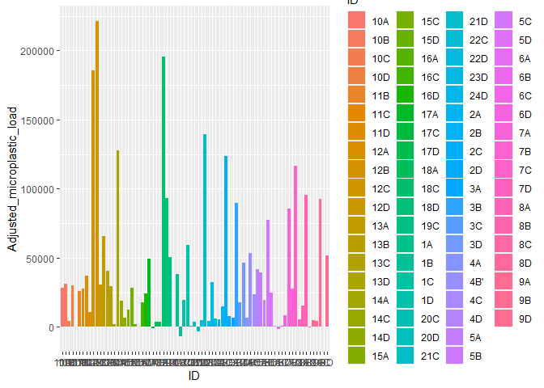
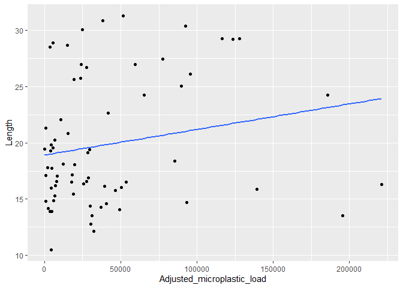

```r
library(tidyverse)
```

```
## Warning: package 'tidyverse' was built under R version 4.1.1
```

```
## -- Attaching packages --------------------------------------- tidyverse 1.3.1 --
```

```
## v ggplot2 3.3.5     v purrr   0.3.4
## v tibble  3.1.5     v dplyr   1.0.7
## v tidyr   1.1.4     v stringr 1.4.0
## v readr   2.0.2     v forcats 0.5.1
```

```
## Warning: package 'tibble' was built under R version 4.1.1
```

```
## Warning: package 'tidyr' was built under R version 4.1.1
```

```
## Warning: package 'readr' was built under R version 4.1.1
```

```
## Warning: package 'purrr' was built under R version 4.1.1
```

```
## Warning: package 'stringr' was built under R version 4.1.1
```

```
## Warning: package 'forcats' was built under R version 4.1.1
```

```
## -- Conflicts ------------------------------------------ tidyverse_conflicts() --
## x dplyr::filter() masks stats::filter()
## x dplyr::lag()    masks stats::lag()
```

```r
library(naniar)
```

```
## Warning: package 'naniar' was built under R version 4.1.1
```

```r
Thermal24<-read.csv("MCMP_quantify.csv")
```


```r
Thermal24_new<-Thermal24%>%
  mutate(Micoplastic_load = as.numeric(Microplastic_load))%>%
  mutate(Adjusted_microplastic_load = as.numeric(Adjusted_microplastic_load))
```

```
## Warning in mask$eval_all_mutate(quo): NAs introducidos por coerción

## Warning in mask$eval_all_mutate(quo): NAs introducidos por coerción
```

```r
Thermal24_new%>%
  ggplot(aes(x=ID, y=Adjusted_microplastic_load,fill=ID))+
  geom_col()
```

```
## Warning: Removed 3 rows containing missing values (position_stack).
```

<!-- -->


```r
Thermal24_3<-Thermal24_new%>%
  filter(Adjusted_microplastic_load>0)
```


```r
Thermal24_3%>%
  ggplot(aes(x=ID, y=Adjusted_microplastic_load,fill=ID))+
  geom_col()+
  theme(axis.text.x = element_text(angle = 90, size = 7, vjust = 1))
```

<!-- -->


```r
Thermal24_3%>%
  ggplot(aes(x=Adjusted_microplastic_load, y=Ave_temp))+
  geom_point()+
  geom_smooth(se=F,method=lm)
```

```
## `geom_smooth()` using formula 'y ~ x'
```

<!-- -->

```r
Thermal24_3%>%
  ggplot(aes(x=Adjusted_microplastic_load, y=Body._index))+
  geom_point()+
  geom_smooth(se=F,method=lm)
```

```
## `geom_smooth()` using formula 'y ~ x'
```

<!-- -->

```r
Thermal24_3%>%
  ggplot(aes(x=Adjusted_microplastic_load, y=Weight))+
  geom_point()+
  geom_smooth(se=F,method=lm)
```

```
## `geom_smooth()` using formula 'y ~ x'
```

<!-- -->

```r
Thermal24_3%>%
  ggplot(aes(x=Adjusted_microplastic_load, y=Length))+
  geom_point()+
  geom_smooth(se=F,method=lm)
```

```
## `geom_smooth()` using formula 'y ~ x'
```

<!-- -->

```r
Thermal24_3%>%
  ggplot(aes(x=Adjusted_microplastic_load, y=Width))+
  geom_point()+
  geom_smooth(se=F,method=lm)
```

```
## `geom_smooth()` using formula 'y ~ x'
```

<!-- -->

```r
library(broom)
```

```
## Warning: package 'broom' was built under R version 4.1.1
```

```r
library(moderndive)
```

```
## Warning: package 'moderndive' was built under R version 4.1.2
```


```r
MP_model<-lm(Ave_temp~Adjusted_microplastic_load, data = Thermal24_3)
```


```r
get_regression_table(MP_model)
```

```
## # A tibble: 2 x 7
##   term                    estimate std_error statistic p_value lower_ci upper_ci
##   <chr>                      <dbl>     <dbl>     <dbl>   <dbl>    <dbl>    <dbl>
## 1 intercept                   33.5     0.535     62.6    0         32.4     34.6
## 2 Adjusted_microplastic_~      0       0         -2.11   0.049      0        0
```

```r
get_regression_summaries(MP_model)
```

```
## # A tibble: 1 x 9
##   r_squared adj_r_squared   mse  rmse sigma statistic p_value    df  nobs
##       <dbl>         <dbl> <dbl> <dbl> <dbl>     <dbl>   <dbl> <dbl> <dbl>
## 1     0.199         0.154  2.40  1.55  1.63      4.47   0.049     1    20
```

```r
Length_model<-lm(Length~Adjusted_microplastic_load, data = Thermal24_3)
get_regression_table(Length_model)
```

```
## # A tibble: 2 x 7
##   term                    estimate std_error statistic p_value lower_ci upper_ci
##   <chr>                      <dbl>     <dbl>     <dbl>   <dbl>    <dbl>    <dbl>
## 1 intercept                   16.0      1.43     11.2    0         13.0   19.0  
## 2 Adjusted_microplastic_~      0        0         1.23   0.234      0      0.001
```

```r
Weight_model<-lm(Weight~Adjusted_microplastic_load, data = Thermal24_3)
get_regression_table(Weight_model)
```

```
## # A tibble: 2 x 7
##   term                    estimate std_error statistic p_value lower_ci upper_ci
##   <chr>                      <dbl>     <dbl>     <dbl>   <dbl>    <dbl>    <dbl>
## 1 intercept                  0.898     0.273      3.28   0.004    0.324     1.47
## 2 Adjusted_microplastic_~    0         0          1.63   0.121    0         0
```

```r
BI_model_2<-lm(Body._index~Adjusted_microplastic_load, data = Thermal24_3)
get_regression_table(BI_model_2)
```

```
## # A tibble: 2 x 7
##   term                    estimate std_error statistic p_value lower_ci upper_ci
##   <chr>                      <dbl>     <dbl>     <dbl>   <dbl>    <dbl>    <dbl>
## 1 intercept                   1.13     0.082    13.8     0        0.955     1.30
## 2 Adjusted_microplastic_~     0        0         0.328   0.746    0         0
```

```r
Width_model<-lm(Width~Adjusted_microplastic_load, data = Thermal24_3)
get_regression_table(Width_model)
```

```
## # A tibble: 2 x 7
##   term                    estimate std_error statistic p_value lower_ci upper_ci
##   <chr>                      <dbl>     <dbl>     <dbl>   <dbl>    <dbl>    <dbl>
## 1 intercept                   8.79     0.871     10.1    0         6.96     10.6
## 2 Adjusted_microplastic_~     0        0          1.43   0.169     0         0
```

