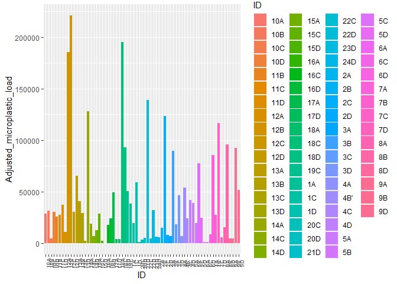

```r
library(tidyverse)
```

```
## Warning: package 'tidyverse' was built under R version 4.1.1
```

```
## -- Attaching packages --------------------------------------- tidyverse 1.3.1 --
```

```
## v ggplot2 3.3.5     v purrr   0.3.4
## v tibble  3.1.5     v dplyr   1.0.7
## v tidyr   1.1.4     v stringr 1.4.0
## v readr   2.0.2     v forcats 0.5.1
```

```
## Warning: package 'tibble' was built under R version 4.1.1
```

```
## Warning: package 'tidyr' was built under R version 4.1.1
```

```
## Warning: package 'readr' was built under R version 4.1.1
```

```
## Warning: package 'purrr' was built under R version 4.1.1
```

```
## Warning: package 'stringr' was built under R version 4.1.1
```

```
## Warning: package 'forcats' was built under R version 4.1.1
```

```
## -- Conflicts ------------------------------------------ tidyverse_conflicts() --
## x dplyr::filter() masks stats::filter()
## x dplyr::lag()    masks stats::lag()
```

```r
library(naniar)
```

```
## Warning: package 'naniar' was built under R version 4.1.1
```

```r
Thermal24<-read.csv("MCMP_quantify.csv")
```


```r
Thermal24_new<-Thermal24%>%
  mutate(Micoplastic_load = as.numeric(Microplastic_load))%>%
  mutate(Adjusted_microplastic_load = as.numeric(Adjusted_microplastic_load))
```

```
## Warning in mask$eval_all_mutate(quo): NAs introducidos por coerción

## Warning in mask$eval_all_mutate(quo): NAs introducidos por coerción
```

```r
Thermal24_new%>%
  ggplot(aes(x=ID, y=Adjusted_microplastic_load,fill=ID))+
  geom_col()
```

```
## Warning: Removed 1 rows containing missing values (position_stack).
```

<!-- -->


```r
Thermal24_3<-Thermal24_new%>%
  filter(Adjusted_microplastic_load>0)
```


```r
Thermal24_3%>%
  ggplot(aes(x=ID, y=Adjusted_microplastic_load,fill=ID))+
  geom_col()+
  theme(axis.text.x = element_text(angle = 90, size = 7, vjust = 1))
```

<!-- -->


```r
Thermal24_3%>%
  ggplot(aes(x=Adjusted_microplastic_load, y=Ave_temp))+
  geom_point()+
  geom_smooth(se=F,method=lm)
```

```
## `geom_smooth()` using formula 'y ~ x'
```

<!-- -->

```r
Thermal24_3%>%
  ggplot(aes(x=Adjusted_microplastic_load, y=Body._index))+
  geom_point()+
  geom_smooth(se=F,method=lm)
```

```
## `geom_smooth()` using formula 'y ~ x'
```

<!-- -->

```r
Thermal24_3%>%
  ggplot(aes(x=Adjusted_microplastic_load, y=Weight))+
  geom_point()+
  geom_smooth(se=F,method=lm)
```

```
## `geom_smooth()` using formula 'y ~ x'
```

<!-- -->

```r
Thermal24_3%>%
  ggplot(aes(x=Adjusted_microplastic_load, y=Length))+
  geom_point()+
  geom_smooth(se=F,method=lm)
```

```
## `geom_smooth()` using formula 'y ~ x'
```

<!-- -->

```r
Thermal24_3%>%
  ggplot(aes(x=Adjusted_microplastic_load, y=Width))+
  geom_point()+
  geom_smooth(se=F,method=lm)
```

```
## `geom_smooth()` using formula 'y ~ x'
```

<!-- -->

```r
library(broom)
```

```
## Warning: package 'broom' was built under R version 4.1.1
```

```r
library(moderndive)
```

```
## Warning: package 'moderndive' was built under R version 4.1.2
```


```r
MP_model<-lm(Ave_temp~Adjusted_microplastic_load, data = Thermal24_3)
```


```r
get_regression_table(MP_model)
```

```
## # A tibble: 2 x 7
##   term                    estimate std_error statistic p_value lower_ci upper_ci
##   <chr>                      <dbl>     <dbl>     <dbl>   <dbl>    <dbl>    <dbl>
## 1 intercept                   33.5     0.494     67.8    0         32.5     34.5
## 2 Adjusted_microplastic_~      0       0         -2.10   0.049      0        0
```

```r
get_regression_summaries(MP_model)
```

```
## # A tibble: 1 x 9
##   r_squared adj_r_squared   mse  rmse sigma statistic p_value    df  nobs
##       <dbl>         <dbl> <dbl> <dbl> <dbl>     <dbl>   <dbl> <dbl> <dbl>
## 1      0.18         0.139  2.29  1.51  1.59      4.39   0.049     1    22
```

```r
Length_model<-lm(Length~Adjusted_microplastic_load, data = Thermal24_3)
get_regression_table(Length_model)
```

```
## # A tibble: 2 x 7
##   term                    estimate std_error statistic p_value lower_ci upper_ci
##   <chr>                      <dbl>     <dbl>     <dbl>   <dbl>    <dbl>    <dbl>
## 1 intercept                   15.3      1.48     10.3    0         12.2   18.4  
## 2 Adjusted_microplastic_~      0        0         2.31   0.032      0      0.001
```

```r
get_regression_summaries(Length_model)
```

```
## # A tibble: 1 x 9
##   r_squared adj_r_squared   mse  rmse sigma statistic p_value    df  nobs
##       <dbl>         <dbl> <dbl> <dbl> <dbl>     <dbl>   <dbl> <dbl> <dbl>
## 1      0.21          0.17  20.6  4.54  4.76      5.31   0.032     1    22
```

```r
Weight_model<-lm(Weight~Adjusted_microplastic_load, data = Thermal24_3)
get_regression_table(Weight_model)
```

```
## # A tibble: 2 x 7
##   term                    estimate std_error statistic p_value lower_ci upper_ci
##   <chr>                      <dbl>     <dbl>     <dbl>   <dbl>    <dbl>    <dbl>
## 1 intercept                  0.834      0.26      3.21   0.004    0.292     1.38
## 2 Adjusted_microplastic_~    0          0         2.45   0.023    0         0
```

```r
get_regression_summaries(Weight_model)
```

```
## # A tibble: 1 x 9
##   r_squared adj_r_squared   mse  rmse sigma statistic p_value    df  nobs
##       <dbl>         <dbl> <dbl> <dbl> <dbl>     <dbl>   <dbl> <dbl> <dbl>
## 1     0.231         0.193 0.633 0.795 0.834      6.02   0.023     1    22
```


```r
BIT_model<-lm(Ave_temp~Body._index, data = Thermal24_3)
get_regression_table(BIT_model)
```

```
## # A tibble: 2 x 7
##   term        estimate std_error statistic p_value lower_ci upper_ci
##   <chr>          <dbl>     <dbl>     <dbl>   <dbl>    <dbl>    <dbl>
## 1 intercept      29.8       1.60     18.6    0       26.5      33.1 
## 2 Body._index     2.54      1.36      1.87   0.076   -0.291     5.37
```

```r
get_regression_summaries(BIT_model)
```

```
## # A tibble: 1 x 9
##   r_squared adj_r_squared   mse  rmse sigma statistic p_value    df  nobs
##       <dbl>         <dbl> <dbl> <dbl> <dbl>     <dbl>   <dbl> <dbl> <dbl>
## 1     0.149         0.106  2.37  1.54  1.62      3.50   0.076     1    22
```


```r
BI_model_2<-lm(Body._index~Adjusted_microplastic_load, data = Thermal24_3)
get_regression_table(BI_model_2)
```

```
## # A tibble: 2 x 7
##   term                    estimate std_error statistic p_value lower_ci upper_ci
##   <chr>                      <dbl>     <dbl>     <dbl>   <dbl>    <dbl>    <dbl>
## 1 intercept                   1.18     0.083    14.3     0         1.01     1.35
## 2 Adjusted_microplastic_~     0        0        -0.467   0.646     0        0
```

```r
Width_model<-lm(Width~Adjusted_microplastic_load, data = Thermal24_3)
get_regression_table(Width_model)
```

```
## # A tibble: 2 x 7
##   term                    estimate std_error statistic p_value lower_ci upper_ci
##   <chr>                      <dbl>     <dbl>     <dbl>   <dbl>    <dbl>    <dbl>
## 1 intercept                   8.50     0.848     10.0    0         6.73     10.3
## 2 Adjusted_microplastic_~     0        0          2.35   0.029     0         0
```

```r
get_regression_summaries(Width_model)
```

```
## # A tibble: 1 x 9
##   r_squared adj_r_squared   mse  rmse sigma statistic p_value    df  nobs
##       <dbl>         <dbl> <dbl> <dbl> <dbl>     <dbl>   <dbl> <dbl> <dbl>
## 1     0.216         0.177  6.73  2.59  2.72      5.51   0.029     1    22
```

```r
Thermal24_3%>%
  ggplot(aes(x=Parasite_load,y=Ave_temp))+
  geom_point()+
  geom_smooth(se=F,method =lm)
```

```
## `geom_smooth()` using formula 'y ~ x'
```

<!-- -->

```r
Thermal24_3%>%
  ggplot(aes(x=Parasite_load,y=Body._index))+
  geom_point()+
  geom_smooth(se=F,method =lm)
```

```
## `geom_smooth()` using formula 'y ~ x'
```

<!-- -->

```r
Thermal24_3%>%
  ggplot(aes(x=Parasite_load,y=Adjusted_microplastic_load))+
  geom_point()+
  geom_smooth(se=F,method =lm)
```

```
## `geom_smooth()` using formula 'y ~ x'
```

<!-- -->

```r
parasite_model<-lm(Adjusted_microplastic_load~Parasite_load, data = Thermal24_3)
get_regression_table(parasite_model)
```

```
## # A tibble: 2 x 7
##   term          estimate std_error statistic p_value lower_ci upper_ci
##   <chr>            <dbl>     <dbl>     <dbl>   <dbl>    <dbl>    <dbl>
## 1 intercept        6092.     2089.     2.92    0.009    1735.   10449.
## 2 Parasite_load     516.     1124.     0.459   0.651   -1828.    2860.
```

```r
PBI_model<-lm(Body._index~Parasite_load, data = Thermal24_3)
get_regression_table(PBI_model)
```

```
## # A tibble: 2 x 7
##   term          estimate std_error statistic p_value lower_ci upper_ci
##   <chr>            <dbl>     <dbl>     <dbl>   <dbl>    <dbl>    <dbl>
## 1 intercept        1.27      0.076     16.7    0         1.11    1.43 
## 2 Parasite_load   -0.085     0.041     -2.07   0.051    -0.17    0.001
```


```r
Thermal24_3%>%
  ggplot(aes(x=Body._index,y=Ave_temp))+
  geom_point()+
  geom_smooth(se=F,method =lm)
```

```
## `geom_smooth()` using formula 'y ~ x'
```

<!-- -->


```r
Mixed_model<-lm(Ave_temp~Parasite_load+Adjusted_microplastic_load, data = Thermal24_3)
get_regression_table(Mixed_model)
```

```
## # A tibble: 3 x 7
##   term                    estimate std_error statistic p_value lower_ci upper_ci
##   <chr>                      <dbl>     <dbl>     <dbl>   <dbl>    <dbl>    <dbl>
## 1 intercept                   33.6     0.607    55.3      0      32.3     34.9  
## 2 Parasite_load               -0.1     0.275    -0.364    0.72   -0.676    0.476
## 3 Adjusted_microplastic_~      0       0        -2.00     0.06    0        0
```

```r
Thermal24_3%>%
  ggplot(aes(x=Adjusted_microplastic_load,y=Ave_temp,size=Parasite_load))+
  geom_point()+
  geom_smooth(se=F,method = lm)
```

```
## `geom_smooth()` using formula 'y ~ x'
```

<!-- -->

