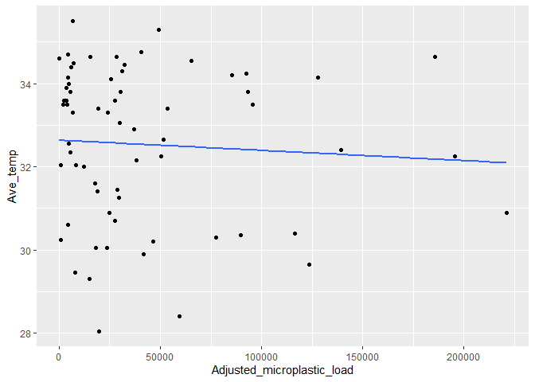
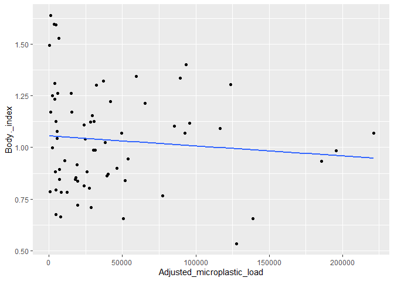
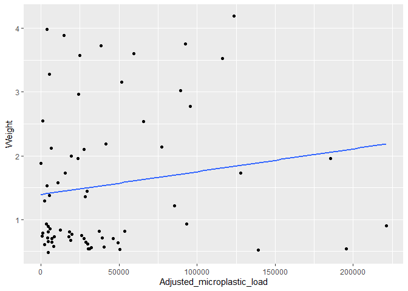
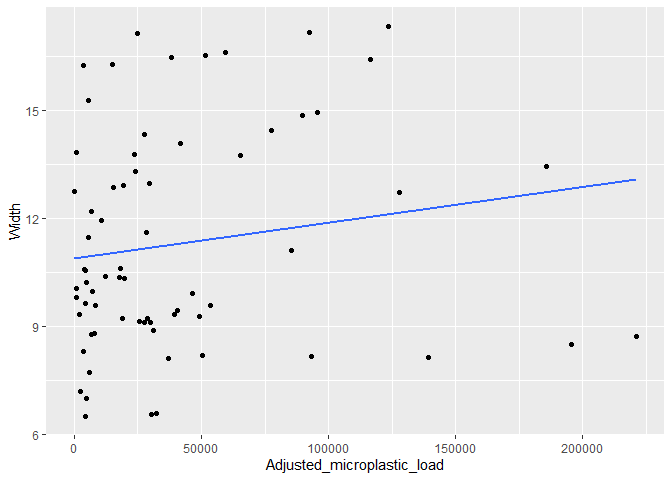
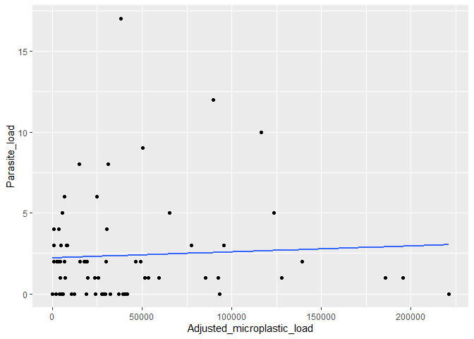

```r
library(tidyverse)
```

```
## Warning: package 'tidyverse' was built under R version 4.1.1
```

```
## -- Attaching packages --------------------------------------- tidyverse 1.3.1 --
```

```
## v ggplot2 3.3.5     v purrr   0.3.4
## v tibble  3.1.5     v dplyr   1.0.7
## v tidyr   1.1.4     v stringr 1.4.0
## v readr   2.0.2     v forcats 0.5.1
```

```
## Warning: package 'tibble' was built under R version 4.1.1
```

```
## Warning: package 'tidyr' was built under R version 4.1.1
```

```
## Warning: package 'readr' was built under R version 4.1.1
```

```
## Warning: package 'purrr' was built under R version 4.1.1
```

```
## Warning: package 'stringr' was built under R version 4.1.1
```

```
## Warning: package 'forcats' was built under R version 4.1.1
```

```
## -- Conflicts ------------------------------------------ tidyverse_conflicts() --
## x dplyr::filter() masks stats::filter()
## x dplyr::lag()    masks stats::lag()
```

```r
library(naniar)
```

```
## Warning: package 'naniar' was built under R version 4.1.1
```


```r
Thermal24<-read.csv("MCMP_quantify.csv")
```


```r
Thermal24_new<-Thermal24%>%
  mutate(Micoplastic_load = as.numeric(Microplastic_load))%>%
  mutate(Adjusted_microplastic_load = as.numeric(Adjusted_microplastic_load))%>%mutate(Ave_temp = as.numeric(Ave_temp))%>%mutate(Micoplastic_load = as.numeric(Microplastic_load))
```


```r
Thermal24_new%>%
  ggplot(aes(x=ID, y=Adjusted_microplastic_load,fill=ID))+
  geom_col()
```

```
## Warning: Removed 1 rows containing missing values (position_stack).
```

<!-- -->


```r
Thermal24_3<-Thermal24_new%>%
  filter(Adjusted_microplastic_load>0)
```


```r
Thermal24_3%>%
  ggplot(aes(x=ID, y=Adjusted_microplastic_load,fill=ID))+
  geom_col()+
  theme(axis.text.x = element_text(angle = 90, size = 7, vjust = 1))
```

<!-- -->


```r
Thermal24_3%>%
  ggplot(aes(x=Adjusted_microplastic_load, y=Ave_temp))+
  geom_point()+
  geom_smooth(se=F,method=lm)
```

```
## `geom_smooth()` using formula 'y ~ x'
```

```
## Warning: Removed 2 rows containing non-finite values (stat_smooth).
```

```
## Warning: Removed 2 rows containing missing values (geom_point).
```

<!-- -->

```r
Thermal24_3%>%
  ggplot(aes(x=Adjusted_microplastic_load, y=Body._index))+
  geom_point()+
  geom_smooth(se=F,method=lm)
```

```
## `geom_smooth()` using formula 'y ~ x'
```

<!-- -->


```r
Thermal24_3%>%
  ggplot(aes(x=Adjusted_microplastic_load, y=Weight))+
  geom_point()+
  geom_smooth(se=F,method=lm)
```

```
## `geom_smooth()` using formula 'y ~ x'
```

<!-- -->

```r
Thermal24_3%>%
  ggplot(aes(x=Adjusted_microplastic_load, y=Length))+
  geom_point()+
  geom_smooth(se=F,method=lm)
```

```
## `geom_smooth()` using formula 'y ~ x'
```

<!-- -->

```r
Thermal24_3%>%
  ggplot(aes(x=Adjusted_microplastic_load, y=Width))+
  geom_point()+
  geom_smooth(se=F,method=lm)
```

```
## `geom_smooth()` using formula 'y ~ x'
```

<!-- -->

```r
library(broom)
```

```
## Warning: package 'broom' was built under R version 4.1.1
```

```r
library(moderndive)
```

```
## Warning: package 'moderndive' was built under R version 4.1.2
```


```r
MP_model<-lm(Ave_temp~Adjusted_microplastic_load, data = Thermal24_3)
```


```r
get_regression_table(MP_model)
```

```
## # A tibble: 2 x 7
##   term                    estimate std_error statistic p_value lower_ci upper_ci
##   <chr>                      <dbl>     <dbl>     <dbl>   <dbl>    <dbl>    <dbl>
## 1 intercept                   33.4     0.403    82.7     0         32.5     34.2
## 2 Adjusted_microplastic_~      0       0        -0.753   0.457      0        0
```

```r
get_regression_summaries(MP_model)
```

```
## # A tibble: 1 x 9
##   r_squared adj_r_squared   mse  rmse sigma statistic p_value    df  nobs
##       <dbl>         <dbl> <dbl> <dbl> <dbl>     <dbl>   <dbl> <dbl> <dbl>
## 1     0.016        -0.013  2.71  1.65  1.69     0.566   0.457     1    36
```

```r
Length_model<-lm(Length~Adjusted_microplastic_load, data = Thermal24_3)
get_regression_table(Length_model)
```

```
## # A tibble: 2 x 7
##   term                    estimate std_error statistic p_value lower_ci upper_ci
##   <chr>                      <dbl>     <dbl>     <dbl>   <dbl>    <dbl>    <dbl>
## 1 intercept                   18.6      1.31    14.2     0         16.0     21.3
## 2 Adjusted_microplastic_~      0        0        0.534   0.597      0        0
```

```r
get_regression_summaries(Length_model)
```

```
## # A tibble: 1 x 9
##   r_squared adj_r_squared   mse  rmse sigma statistic p_value    df  nobs
##       <dbl>         <dbl> <dbl> <dbl> <dbl>     <dbl>   <dbl> <dbl> <dbl>
## 1     0.008         -0.02  30.6  5.53  5.68     0.285   0.597     1    38
```

```r
Weight_model<-lm(Weight~Adjusted_microplastic_load, data = Thermal24_3)
get_regression_table(Weight_model)
```

```
## # A tibble: 2 x 7
##   term                    estimate std_error statistic p_value lower_ci upper_ci
##   <chr>                      <dbl>     <dbl>     <dbl>   <dbl>    <dbl>    <dbl>
## 1 intercept                   1.46     0.243     6.00    0        0.967     1.95
## 2 Adjusted_microplastic_~     0        0         0.082   0.935    0         0
```

```r
get_regression_summaries(Weight_model)
```

```
## # A tibble: 1 x 9
##   r_squared adj_r_squared   mse  rmse sigma statistic p_value    df  nobs
##       <dbl>         <dbl> <dbl> <dbl> <dbl>     <dbl>   <dbl> <dbl> <dbl>
## 1         0        -0.028  1.05  1.02  1.05     0.007   0.935     1    38
```


```r
BIT_model<-lm(Ave_temp~Body._index, data = Thermal24_3)
get_regression_table(BIT_model)
```

```
## # A tibble: 2 x 7
##   term        estimate std_error statistic p_value lower_ci upper_ci
##   <chr>          <dbl>     <dbl>     <dbl>   <dbl>    <dbl>    <dbl>
## 1 intercept     32.9        1.25    26.4     0        30.4     35.5 
## 2 Body._index    0.176      1.09     0.161   0.873    -2.04     2.40
```

```r
get_regression_summaries(BIT_model)
```

```
## # A tibble: 1 x 9
##   r_squared adj_r_squared   mse  rmse sigma statistic p_value    df  nobs
##       <dbl>         <dbl> <dbl> <dbl> <dbl>     <dbl>   <dbl> <dbl> <dbl>
## 1     0.001        -0.029  2.75  1.66  1.71     0.026   0.873     1    36
```


```r
BI_model_2<-lm(Body._index~Adjusted_microplastic_load, data = Thermal24_3)
get_regression_table(BI_model_2)
```

```
## # A tibble: 2 x 7
##   term                    estimate std_error statistic p_value lower_ci upper_ci
##   <chr>                      <dbl>     <dbl>     <dbl>   <dbl>    <dbl>    <dbl>
## 1 intercept                   1.13     0.061    18.6     0         1.01     1.25
## 2 Adjusted_microplastic_~     0        0        -0.658   0.515     0        0
```

```r
Width_model<-lm(Width~Adjusted_microplastic_load, data = Thermal24_3)
get_regression_table(Width_model)
```

```
## # A tibble: 2 x 7
##   term                    estimate std_error statistic p_value lower_ci upper_ci
##   <chr>                      <dbl>     <dbl>     <dbl>   <dbl>    <dbl>    <dbl>
## 1 intercept                   10.5     0.696    15.1      0        9.09     11.9
## 2 Adjusted_microplastic_~      0       0         0.634    0.53     0         0
```

```r
get_regression_summaries(Width_model)
```

```
## # A tibble: 1 x 9
##   r_squared adj_r_squared   mse  rmse sigma statistic p_value    df  nobs
##       <dbl>         <dbl> <dbl> <dbl> <dbl>     <dbl>   <dbl> <dbl> <dbl>
## 1     0.011        -0.016  8.59  2.93  3.01     0.402    0.53     1    38
```

```r
Thermal24_3%>%
  ggplot(aes(x=Parasite_load,y=Ave_temp))+
  geom_point()+
  geom_smooth(se=F,method =lm)
```

```
## `geom_smooth()` using formula 'y ~ x'
```

```
## Warning: Removed 2 rows containing non-finite values (stat_smooth).
```

```
## Warning: Removed 2 rows containing missing values (geom_point).
```

<!-- -->

```r
Thermal24_3%>%
  ggplot(aes(x=Parasite_load,y=Body._index))+
  geom_point()+
  geom_smooth(se=F,method =lm)
```

```
## `geom_smooth()` using formula 'y ~ x'
```

<!-- -->

```r
Thermal24_3%>%
  ggplot(aes(x=Adjusted_microplastic_load,y=Parasite_load))+
  geom_point()+
  geom_smooth(se=F,method =lm)
```

```
## `geom_smooth()` using formula 'y ~ x'
```

<!-- -->

```r
parasite_model<-lm(Adjusted_microplastic_load~Parasite_load, data = Thermal24_3)
get_regression_table(parasite_model)
```

```
## # A tibble: 2 x 7
##   term          estimate std_error statistic p_value lower_ci upper_ci
##   <chr>            <dbl>     <dbl>     <dbl>   <dbl>    <dbl>    <dbl>
## 1 intercept       11296.     1972.      5.73   0        7296.   15296.
## 2 Parasite_load    -593.      548.     -1.08   0.286   -1704.     517.
```

```r
PBI_model<-lm(Body._index~Parasite_load, data = Thermal24_3)
get_regression_table(PBI_model)
```

```
## # A tibble: 2 x 7
##   term          estimate std_error statistic p_value lower_ci upper_ci
##   <chr>            <dbl>     <dbl>     <dbl>   <dbl>    <dbl>    <dbl>
## 1 intercept        1.11      0.052    21.4      0       1.01     1.22 
## 2 Parasite_load   -0.005     0.014    -0.348    0.73   -0.034    0.024
```


```r
Thermal24_3%>%
  ggplot(aes(x=Body._index,y=Ave_temp))+
  geom_point()+
  geom_smooth(se=F,method =lm)
```

```
## `geom_smooth()` using formula 'y ~ x'
```

```
## Warning: Removed 2 rows containing non-finite values (stat_smooth).
```

```
## Warning: Removed 2 rows containing missing values (geom_point).
```

<!-- -->


```r
Mixed_model<-lm(Ave_temp~Parasite_load+Adjusted_microplastic_load, data = Thermal24_3)
get_regression_table(Mixed_model)
```

```
## # A tibble: 3 x 7
##   term                    estimate std_error statistic p_value lower_ci upper_ci
##   <chr>                      <dbl>     <dbl>     <dbl>   <dbl>    <dbl>    <dbl>
## 1 intercept                 33.5       0.487    68.8     0       32.5      34.5 
## 2 Parasite_load             -0.046     0.097    -0.48    0.634   -0.243     0.15
## 3 Adjusted_microplastic_~    0         0        -0.825   0.416    0         0
```

```r
Thermal24_3%>%
  ggplot(aes(x=Adjusted_microplastic_load,y=Ave_temp,color=as.factor(Parasite_load)))+
  geom_point()+
  geom_smooth(se=F,method = lm)
```

```
## `geom_smooth()` using formula 'y ~ x'
```

```
## Warning: Removed 2 rows containing non-finite values (stat_smooth).
```

```
## Warning: Removed 2 rows containing missing values (geom_point).
```

<!-- -->


```r
library(haven)
```

```
## Warning: package 'haven' was built under R version 4.1.3
```

```r
library(lme4)
```

```
## Warning: package 'lme4' was built under R version 4.1.3
```

```
## Loading required package: Matrix
```

```
## 
## Attaching package: 'Matrix'
```

```
## The following objects are masked from 'package:tidyr':
## 
##     expand, pack, unpack
```


```r
library(car)
```

```
## Loading required package: carData
```

```
## Warning: package 'carData' was built under R version 4.1.3
```

```
## 
## Attaching package: 'car'
```

```
## The following object is masked from 'package:dplyr':
## 
##     recode
```

```
## The following object is masked from 'package:purrr':
## 
##     some
```


